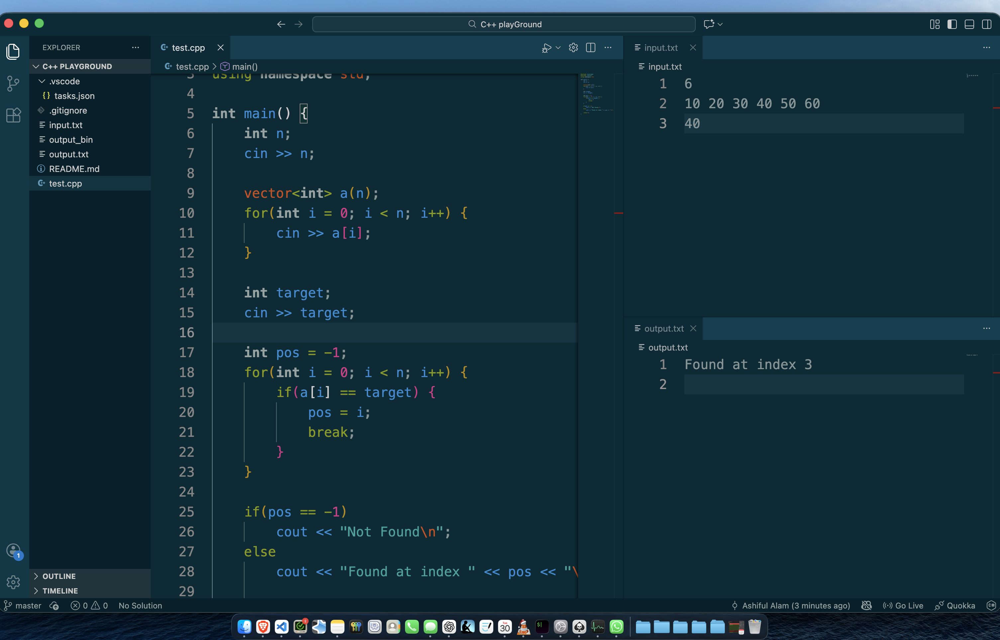

# C++ Competitive Programming Setup (Mac)

This repository contains my automated C++ environment for Competitive Programming. It is designed to allow side-by-side coding, input entry, and output viewing with a single keyboard shortcut.



## 🛠 Requirements

Before running this setup on a new Mac device, you must install the following:

1.  **Command Line Tools (Clang/G++):**
    Open your terminal and run the following command to install the C++ compiler:
    ```bash
    xcode-select --install
    ```
2.  **Visual Studio Code:**
    Download and install [VS Code](https://code.visualstudio.com/).
3.  **C/C++ Extension:**
    Inside VS Code, install the **"C/C++"** extension by Microsoft (extension ID: `ms-vscode.cpptools`).

---

## 🚀 How to Use

### 1. The Layout

To replicate the environment shown in the setup:

- Open your `.cpp` file on the **left**.
- Open `input.txt` on the **top right**.
- Open `output.txt` on the **bottom right**.

### 2. Running Code

I have configured a custom task in `.vscode/tasks.json` that automates the compilation and execution process.

- **Shortcut:** Press `Cmd + Shift + B`
- **What happens:** 1. The active `.cpp` file is compiled. 2. It takes input from `input.txt`. 3. It writes the results to `output.txt`. 4. The terminal remains hidden to keep the workspace clean.

---

## 📂 File Structure

- `.vscode/` - Contains `tasks.json` (The automation logic).
- `input.txt` - Place your test cases here.
- `output.txt` - Results will appear here automatically.
- `*.cpp` - Your C++ source files.
