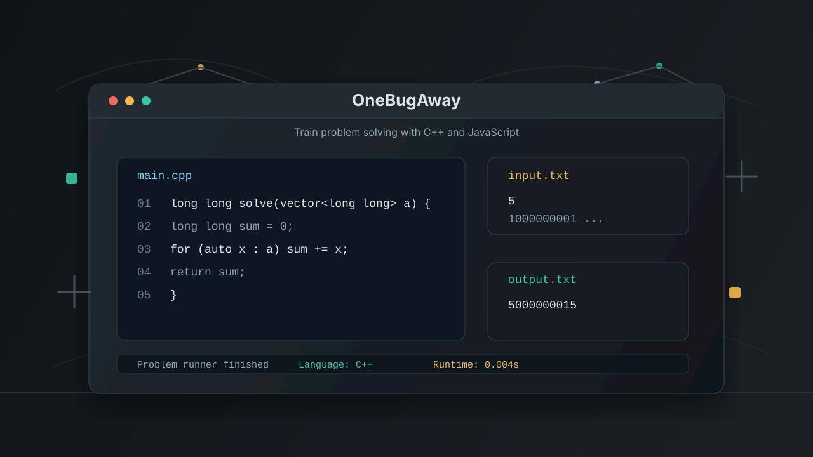

# OneBugAway

A minimal C++ and JavaScript problem-solving workspace for VS Code and GitHub Codespaces.



## Quick Start

1. Open `cppWorkspace.code-workspace`.
2. Open a `.cpp` or `.js` problem file.
3. Put sample input in `input.txt`.
4. Run the build task.
5. Read the result from `output.txt`.

## Run Shortcuts

| Environment | Shortcut |
| --- | --- |
| macOS local custom shortcut | `Cmd + R` |
| macOS local default task | `Cmd + Shift + B` |
| Windows/Linux local default task with Bash | `Ctrl + Shift + B` |
| Codespaces on macOS | `Cmd + Shift + B` |
| Codespaces on Windows/Linux | `Ctrl + Shift + B` |

After running a problem once, you can focus `input.txt` or `output.txt` and run again. The runner reuses the current problem file.

## Common Tasks

1. Set up locally: [docs/setup.md](docs/setup.md)
2. Run code: [docs/running-code.md](docs/running-code.md)
3. Create a problem file: [docs/new-problem.md](docs/new-problem.md)
4. Use Codespaces: [docs/codespaces.md](docs/codespaces.md)
5. Configure shortcuts: [docs/shortcuts.md](docs/shortcuts.md)
6. Enable Gemini complexity estimates: [docs/gemini-complexity.md](docs/gemini-complexity.md)
7. Review helper tasks: [docs/tools.md](docs/tools.md)
8. Check project files: [docs/project-structure.md](docs/project-structure.md)
9. Manage Explorer cleanup: [docs/workspace-cleanup.md](docs/workspace-cleanup.md)
10. Check git safety: [docs/git-safety.md](docs/git-safety.md)

## Project Map

```text
.vscode/                    VS Code tasks and helper scripts
.devcontainer/              Codespaces setup
config/                     Local config and ignored state
docs/                       Workspace guides
problems/                   Saved problem solutions
problems/templates/         New-problem templates
scripts/setup-check.sh      macOS setup checker
input.txt                   Shared sample input
output.txt                  Shared program output
testcpp.cpp                 Scratch C++ file
testJS.js                   Scratch JavaScript file
```
