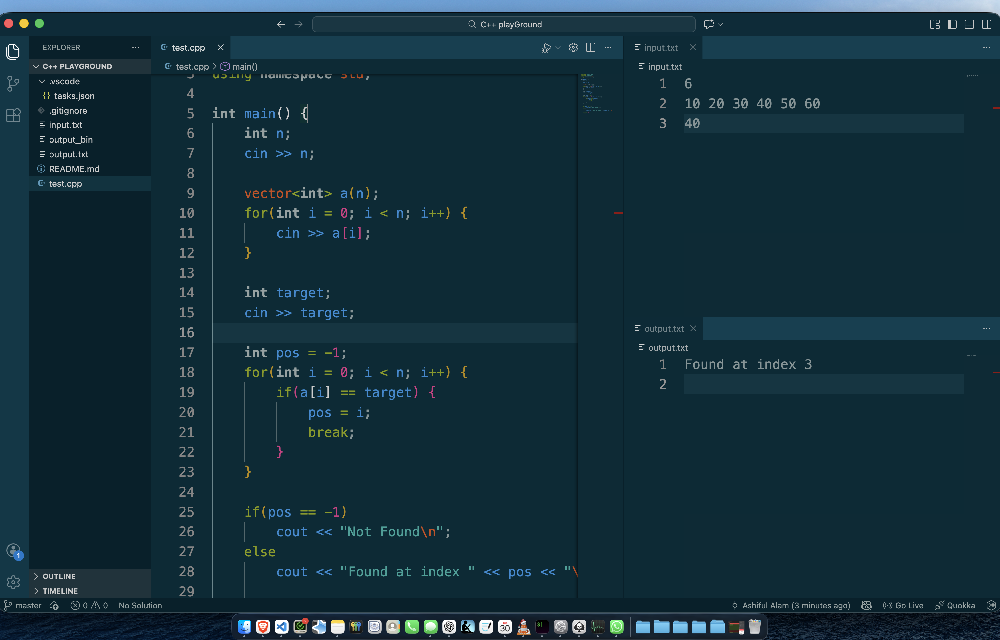

# C++ and JavaScript Problem Solving Setup

This repository contains a small VS Code playground for solving programming problems in both C++ and JavaScript. It uses one shared input file, one shared output file, and one build task that automatically chooses the correct runner based on the file you are working on.



## New Mac Setup

Install these tools on a new Mac before using the playground:

1. **Command Line Tools (Clang/G++):**
   ```bash
   xcode-select --install
   ```
2. **Node.js:** Install from [nodejs.org](https://nodejs.org/), then check:
   ```bash
   node --version
   ```
3. **Visual Studio Code:** Download from [code.visualstudio.com](https://code.visualstudio.com/).
4. **C/C++ Extension:** Install the Microsoft C/C++ extension in VS Code.

Before using the runner, these commands should work in the VS Code terminal:

```bash
g++ --version
node --version
bash --version
```

You can also run the setup checker:

```bash
./setup-check.sh
```

The setup checker verifies the required tools, starts the Command Line Tools installer if needed, installs Homebrew when it is missing, installs Node.js through Homebrew when needed, and makes the runner executable.

To run it on a new Mac:

```bash
cd /path/to/playGround
chmod +x setup-check.sh
./setup-check.sh
```

Replace `/path/to/playGround` with the folder location on that Mac.

## How to Use

### 1. Recommended Layout

- Open `testcpp.cpp` or `testJS.js` on the **left**.
- Open `input.txt` on the **top right**.
- Open `output.txt` on the **bottom right**.

### 2. Running Code

The default build task in `.vscode/tasks.json` calls `.vscode/run-active-problem.sh`.

- If the active file is `.cpp`, it compiles and runs the C++ file.
- If the active file is `.js`, it runs the JavaScript file with Node.js.
- If the active file is `input.txt`, it runs the most recently modified `.cpp` or `.js` file in this folder.

The task always reads from:

```text
input.txt
```

The task always writes to:

```text
output.txt
```

After each run, the terminal shows the language, file name, input file, output file, and runtime duration. If C++ compilation fails or a program crashes, the terminal shows a clearer failure summary after the original compiler/runtime error.

## Shortcut

By default, VS Code uses `Cmd + Shift + B` to run the build task.

To run this playground with `Cmd + R`:

1. Open Keyboard Shortcuts with `Cmd + K`, then `Cmd + S`.
2. Search for `Tasks: Run Build Task`.
3. Click the pencil icon beside `Tasks: Run Build Task`.
4. Press `Cmd + R`, then press Enter.
5. If VS Code shows a conflict with `Developer: Reload Window`, search for that command.
6. Right-click the `Cmd + R` keybinding for `Developer: Reload Window`.
7. Choose `Remove Keybinding`.

After this, `Cmd + R` runs the active `.cpp` or `.js` problem file and updates `output.txt`.

## File Structure

- `.vscode/tasks.json` - VS Code build task.
- `.vscode/run-active-problem.sh` - Detects and runs C++ or JavaScript files.
- `cppWorkspace.code-workspace` - Workspace settings for this playground.
- `setup-check.sh` - Checks and installs missing Mac dependencies.
- `problems/` - Optional folder for organizing solved problems.
- `testcpp.cpp` - Sample C++ problem file.
- `testJS.js` - Sample JavaScript problem file.
- `input.txt` - Place test cases here.
- `output.txt` - Results appear here automatically.
- `images/setUp.png` - Workspace screenshot.
